[](https://github.com/NikhilSinha0/llm_mlops/actions/workflows/rust.yml)

# LLM Ops

This is the final project for group 6 for IDS 721. The project involves taking an open source model from HuggingFace and creating a web service in Rust to serve inferences from the model. The webservice needs to be deployed on a Kubernetes cluster and set up with some monitoring and metrics. There also needs to be a CI/CD pipeline for this repository to automate the process of testing/building/deployment of the service.

## Build and Dockerization Process

The build process for this project is requires some assets. First you need to download a model from huggingface, and keep it in a known location in the repository.

This process is simplified as you can simply call the `model/get_model.sh` script to download the correct model and set it up with the correct name and location without direct user input.

You can then build this binary using `cargo build`. You then need to copy it alongside the built application binary into a docker container to deploy.

To simplify this, the binary has been packaged with a Dockerfile. This Dockerfile will build the binary, including the predownloaded assets. Once the binary is built, it is pushed to ECR using

```
export ECR_URL=<ECR Repo URL>
docker build -t $ECR_URL:latest .
aws ecr get-login-password --region <region> | docker login --username AWS --password-stdin $ECR_URL
docker push $ECR_URL:latest
```

A simpler way to do this is to simply call the
```
deploy/build.sh
```
script instead, which will run these instructions for you. You need to pass a few options. Example usage could be
```
./deploy/build.sh -u <ECR_REPO> -n
```
which will build the container but not deploy it to ECR, or
```
./deploy/build.sh -u <ECR_REPO> -r <REGION>
```
which will build and deploy the container to ECR in a region other than us-west-2

Once you have a built container, you can run it locally to test using a command like
```
docker run -it --rm -p 8080:8080 $ECR_URL:latest
```

and hit the endpoint with a command like
```
curl -X POST -H "Content-Type: application/json" --data '{"input": "tigers are cool because"}' http://localhost:8080/message
```
run from a new terminal (since the original terminal will be running the service).

## Kubernetes - Container Orchestration

Amazon Elastic Kubernetes Service (Amazon EKS) is a managed service that makes it easy for you to run Kubernetes on AWS without needing to install and operate your own Kubernetes clusters.

### Installation
In order to use the command line interface and interact with EKS, you need to install two things: kubectl and eksctl. Run the following commands (assuming you have homebrew) to install.
* kubectl
    * `brew install kubectl`
* eksctl
    * `brew tap weaveworks/tap`
    * `brew install weaveworks/tap/eksctl`

### Cluster and Namespace Creation
First, we need to create a kubernetes cluster and a namespace

To create a cluster, run: 

`eksctl create cluster 'sample-cluster2' --zones us-east-1a,us-east-1b,us-east-1c`

To create a namespace, run: 

`kubectl create namespace {name of namespace}`

### Deploy Docker Image to Cluster

To deploy the docker image to cluster, we need to write two yaml files and run two commands.

The deployment.yaml file pulls a container image from a public repository and deploys three replicas (known as pods).

The service.yaml file allows you to access all replicas through a single IP address or name. We are able to add load balancing here. This performs monitoring and metrics

Once the .yaml files are written, run the following two lines of code:

`kubectl apply -f {name of deployment yaml file}.yaml`

`kubectl apply -f {name of service yaml file}.yaml`


### QC Deployment

Run the following commands to confirm there are actively running pods

`kubectl get all -n {name of namespace}`

Details of the deployment can be found by running: 

`kubectl -n {name of app} describe service {name of service}`

## Usage

This webservice is intended to be used with cURL. A command for usage should look like

```
curl -X POST -H "Content-Type: application/json" --data '{"context": "mary is my mother", "query": "who is mary"}' http://a32c9ee0e4f5e4632beea263c7bce134-2036735149.us-west-2.elb.amazonaws.com/answer_question
```

and should return an answer from the model like

```
my mother
```
.


## Screenshots

### Create Public ECR

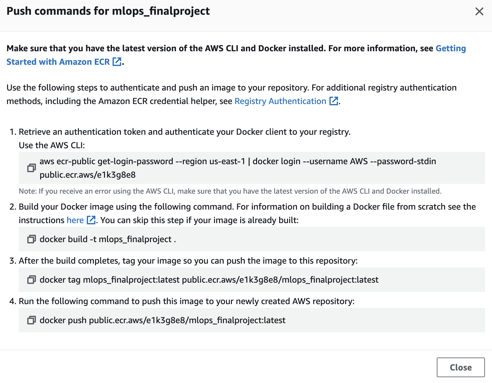

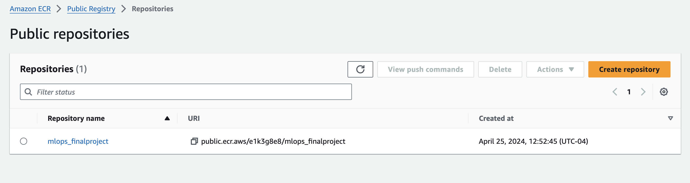

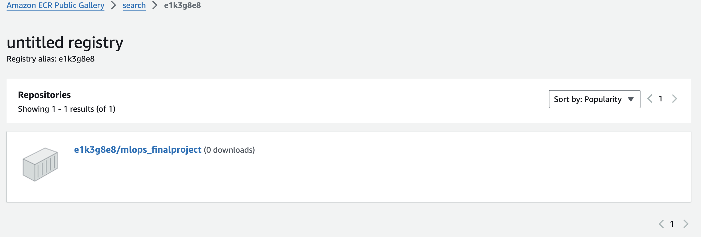

### EKS Cluster Creation

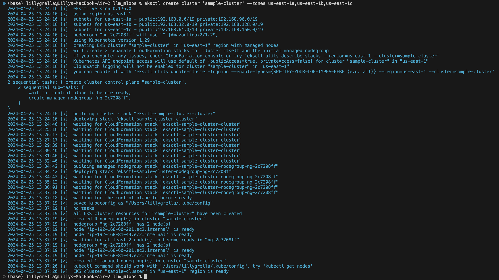

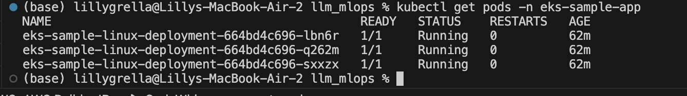

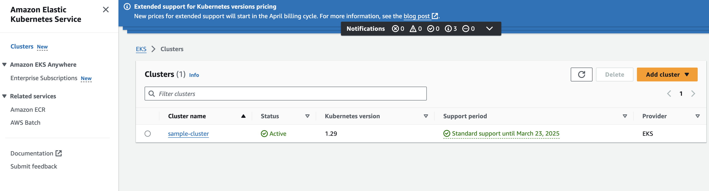

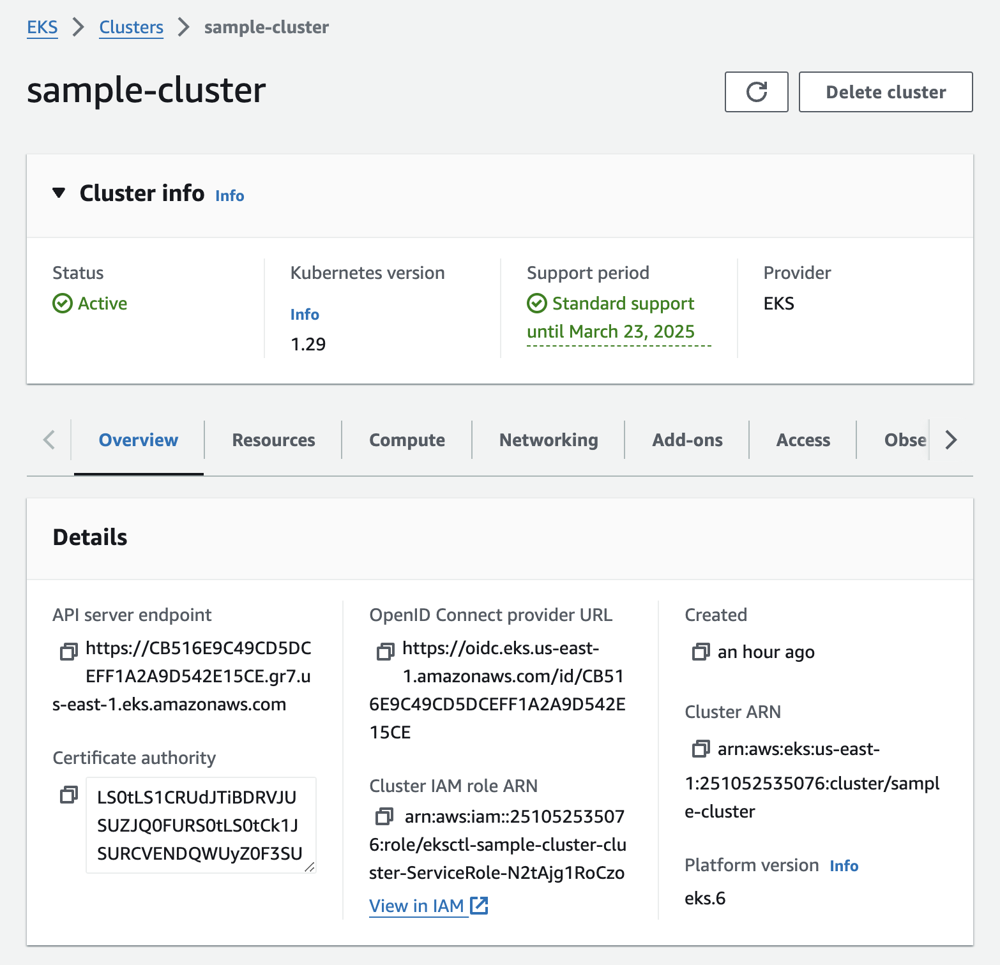

### Monitoring and Metrics

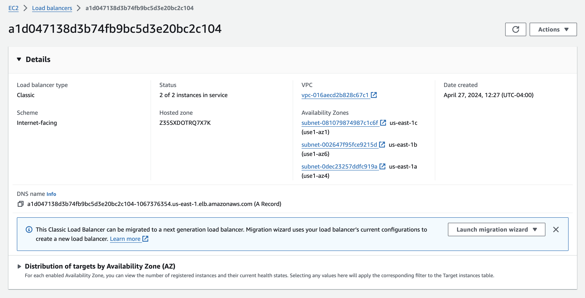

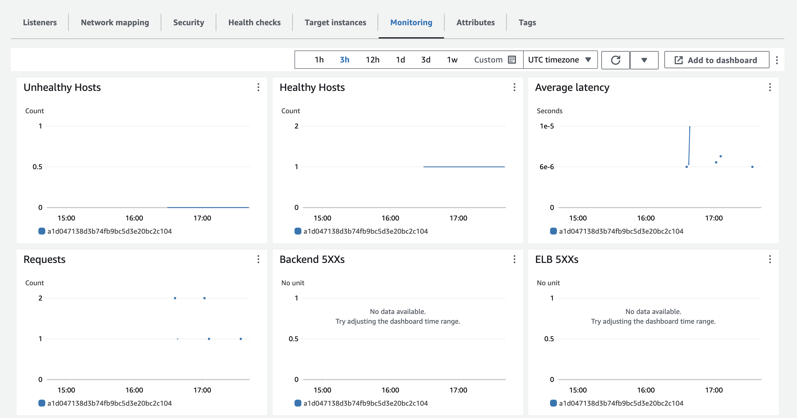

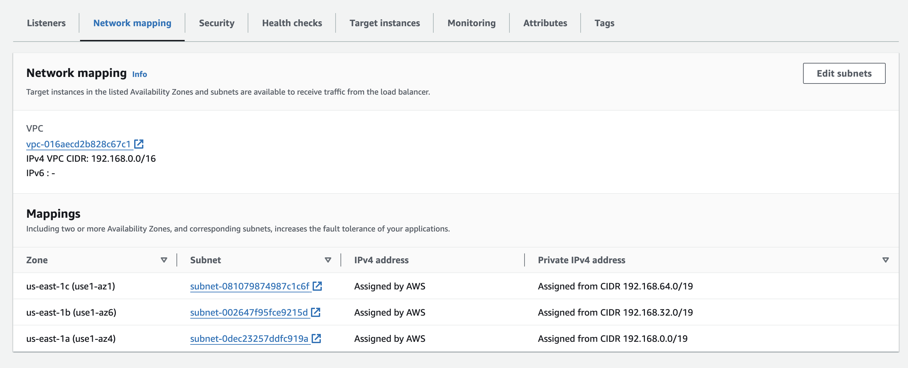

### Working Rust Web Service

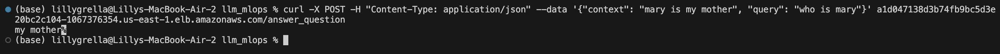

